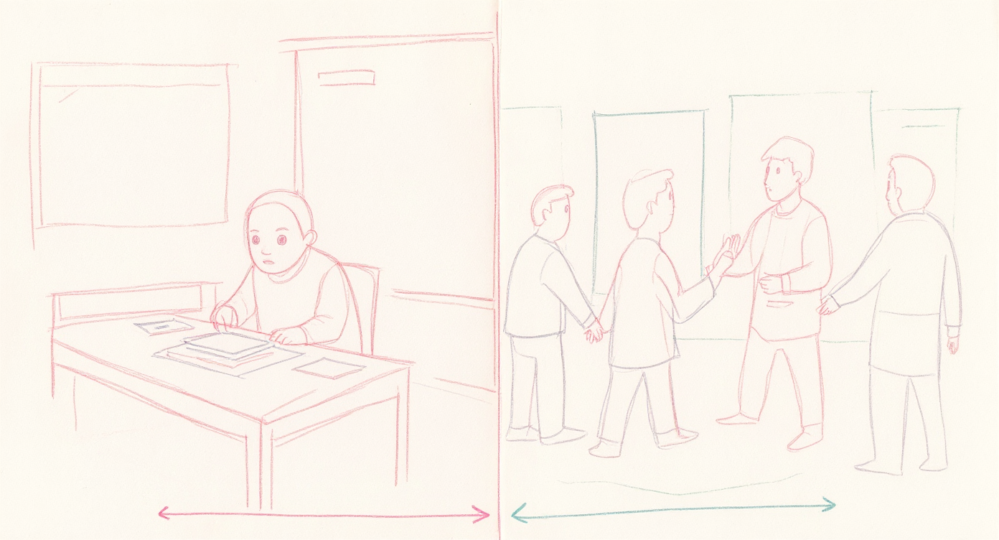
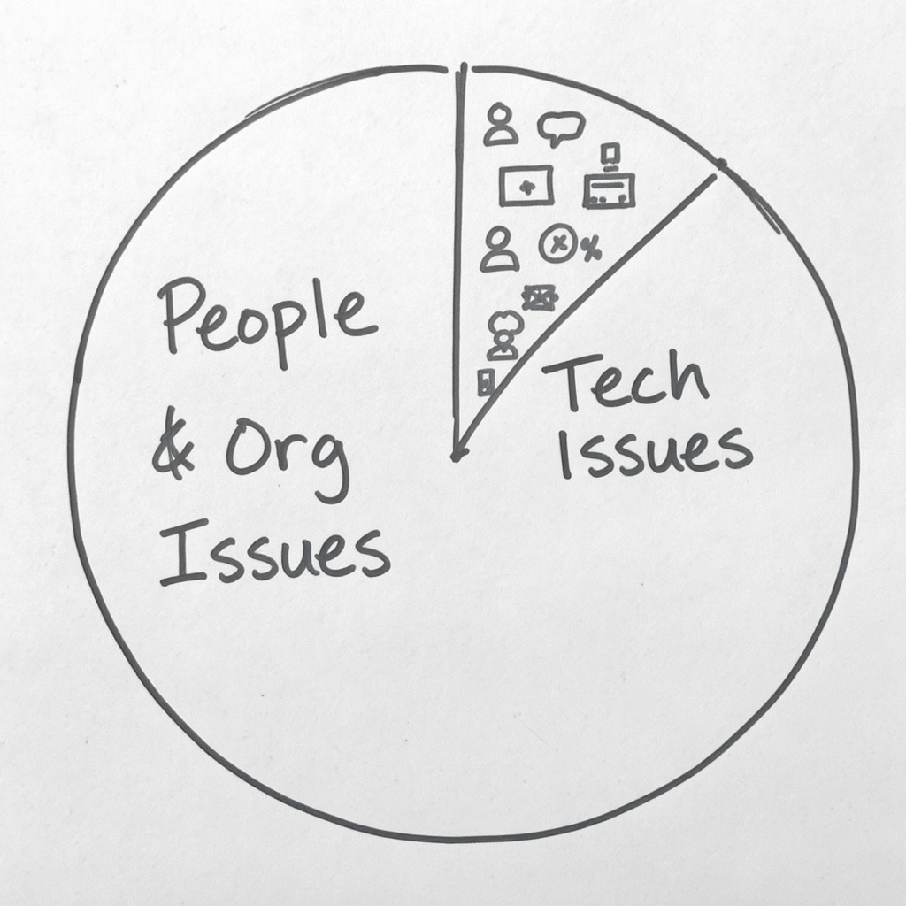
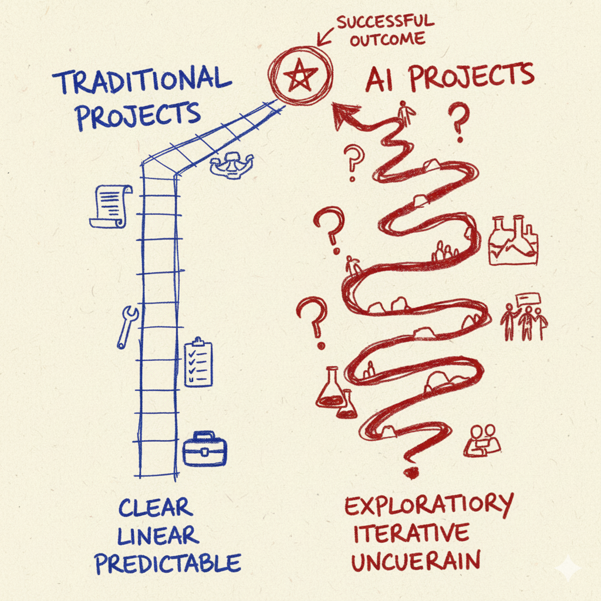
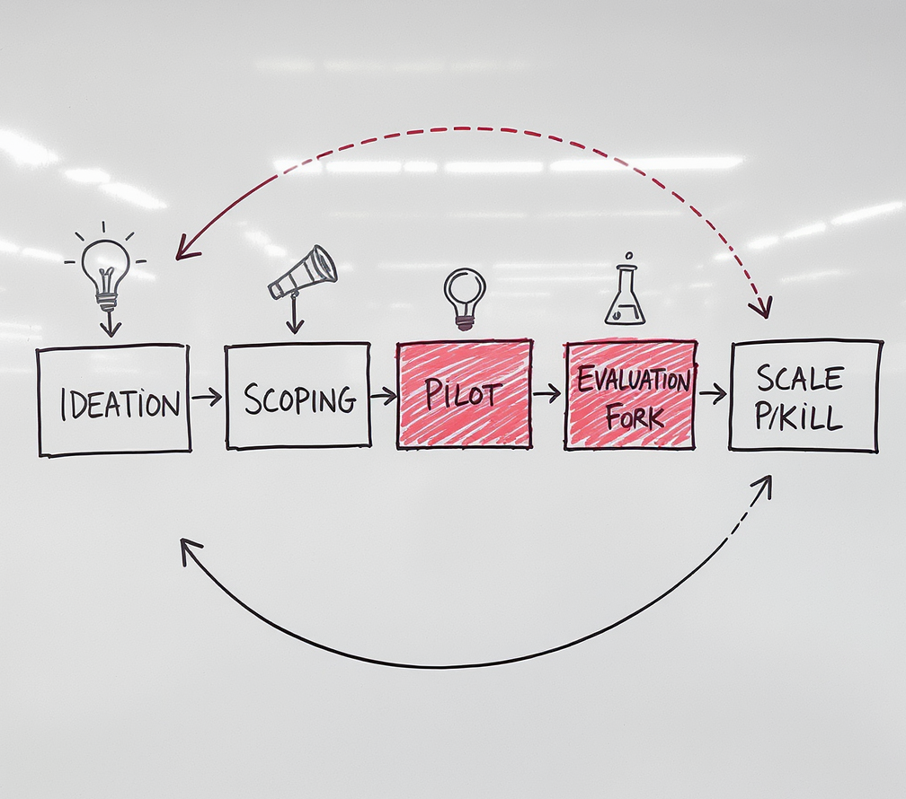
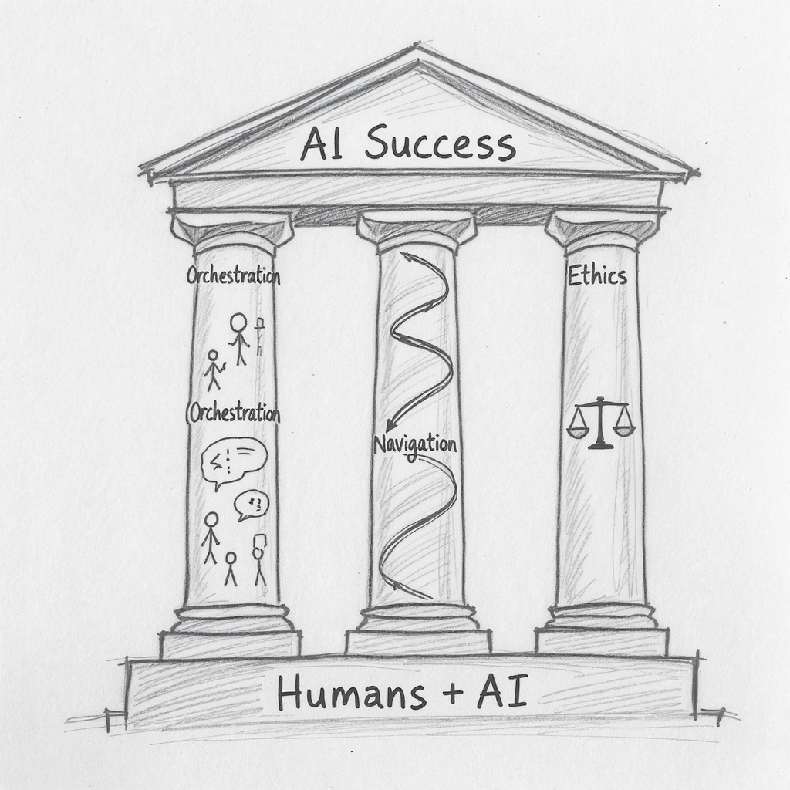
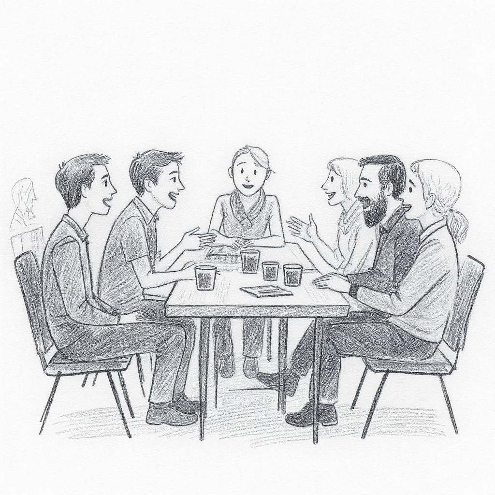
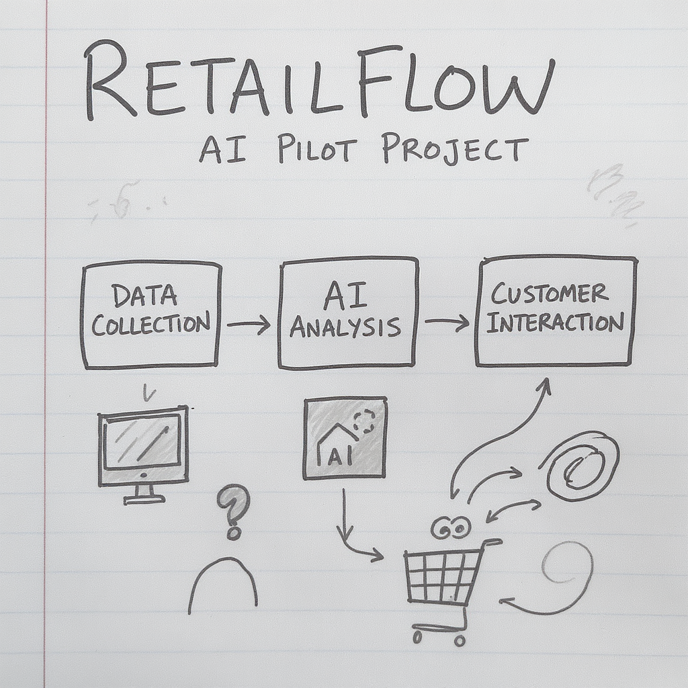
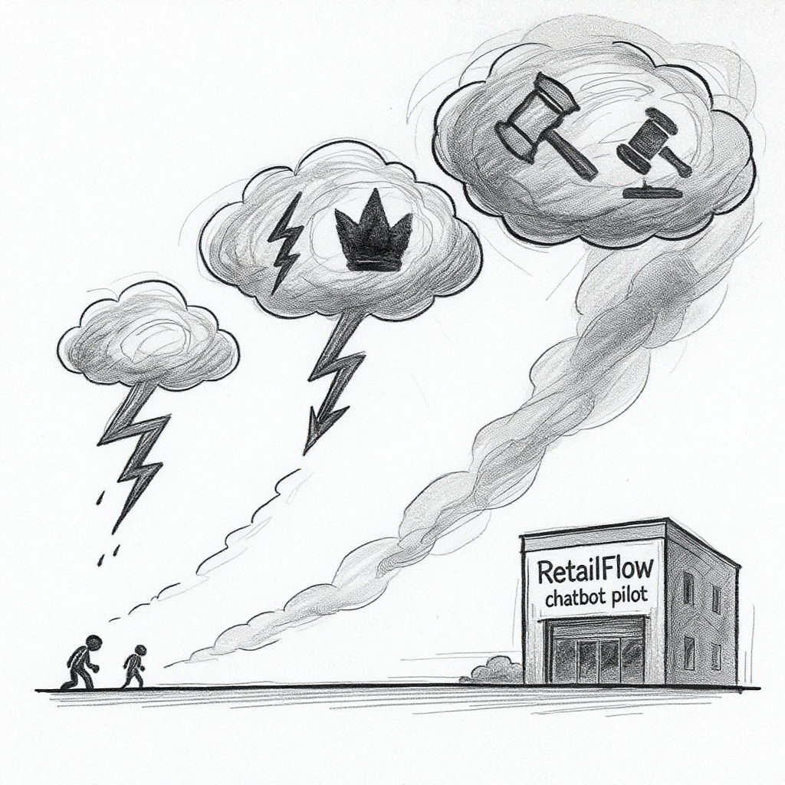
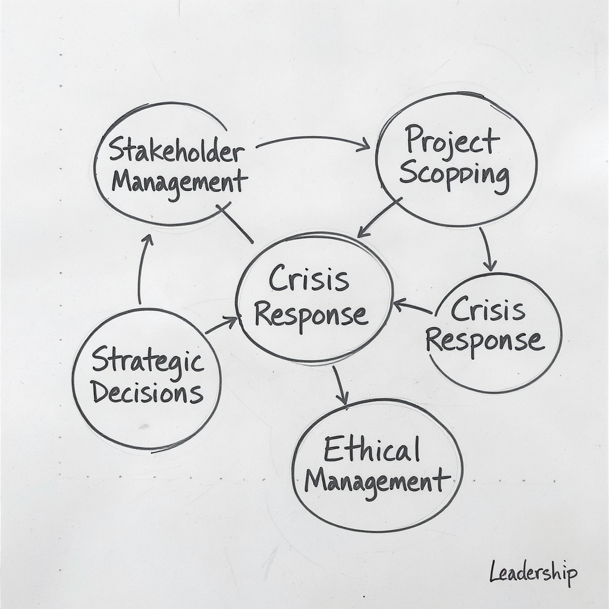
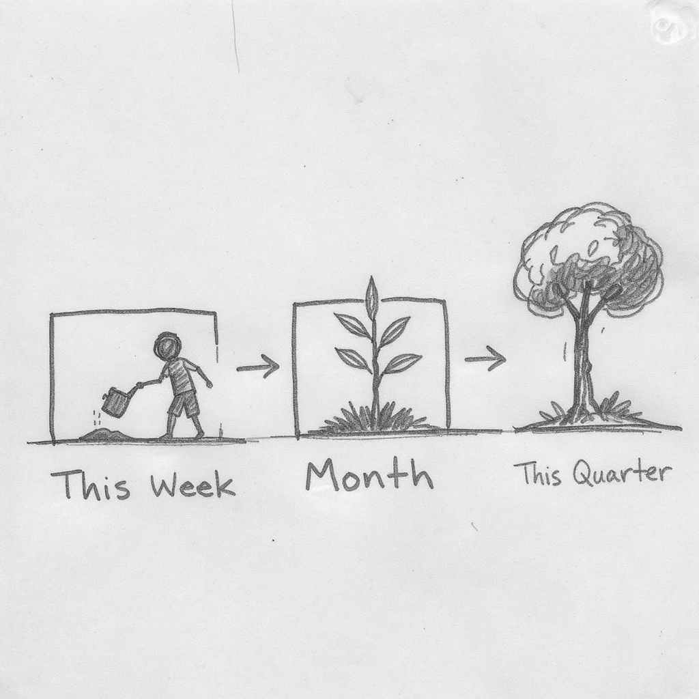

# Welcome

::: {.notes}
- "Today isn't about theory - it's about practice"
- "You'll work hard, think critically, make difficult decisions"
:::

---

# Today's Journey

**Timeline for the Day:**

- 9:00-10:30am → **Foundations & Frameworks**
- 10:30-11:00am → Morning Tea
- 11:00-12:30pm → **Stakeholder Management & Project Scoping**
- 12:30-1:15pm → Lunch & Networking
- 1:15-2:30pm → **Crisis Management in Action**
- 2:30-3:00pm → Afternoon Tea
- 3:00-4:00pm → **Strategic Decisions: Scale or Kill**
- 4:00-4:30pm → **Personal Action Planning & Framework Synthesis**

::: {.notes}
- "This is a full, intense day but incredibly rewarding"
- "You'll leave with practical skills, not just notes"
- "Every exercise builds on previous learning"
:::

---

# Learning Outcomes

**You will:**
- Design • Manage • Navigate • Decide • Apply

::: {.notes}
- "These aren't just academic goals"
- "By end of today: Design AI projects with appropriate scope and success metrics"
- "Manage diverse stakeholders effectively in AI initiatives"
- "Navigate ethical dilemmas and value-based decision making"
- "Make informed scale/pivot/kill decisions for AI pilots"
- "Apply crisis management frameworks to real AI project challenges"
- "You'll actually PRACTICE each of these today"
- "You'll leave with tools you can use Monday morning"

**Lecture vs. Practice**

Lecture → Decision-making
Notes → Action
Passive → Active
Theory → Muscle Memory

- "Today you'll experience what AI project leadership FEELS like"
- "The crises you'll face are based on real projects"
- "Some of you will feel uncomfortable - that's where learning happens"
:::

---

# The Reality of AI Projects

::: {.notes}

The Brutal Truth About AI Projects. **80% of AI projects fail to deliver value**

*Source: Gartner, 2023*

- "Let that sink in - 4 out of 5 AI projects fail"
- "Technical Issues: 20% - Algorithm doesn't work, Data quality problems, Infrastructure failures"
- "People & Organisational Issues: 80% - Stakeholder resistance, Unclear objectives, Poor change management, Ethical oversights, Wrong metrics, Scope creep"
- "Not because technology doesn't work..."
- "AI project leadership is NOT primarily about technology"
- "It's about people, politics, and change"
- "That's what we're focusing on today"
:::

---

# Real AI Project Failures

::: {.notes}

🏥 Healthcare: Perfect algorithm, clinicians didn't trust it

🏪 Retail: Worked great, destroyed jobs and PR

💰 Banking: Solved the problem, discriminated against people

- "These are real projects (anonymised)"
- "Healthcare: $5M investment, 2-year development, 95% accuracy in lab testing. Clinicians refused to use it. Forgot about user adoption."
- "Retail: Reduced stockouts by 40% (success!). Automated away jobs, union backlash, PR disaster. Didn't manage people impact."
- "Banking: Improved processing speed by 70%. Discriminated against protected groups. Ethical oversight missing."
- "All had solid technology"
- "All failed because of people and process issues"
- "Today you'll practice navigating exactly these challenges"
:::

---

# Traditional vs. AI Projects

::: {.notes}

**Two Different Journeys**

Traditional: Known → Linear → Clear → Predictable → Technical risk
AI: Emergent → Iterative → Evolving → Experimental → Organisational risk

- "Many of you have led successful traditional projects"
- "AI projects require DIFFERENT skills - not better or worse, different"
- "Traditional: Requirements known upfront, linear progression, success criteria clear, predictable timeline, technical risk primary, implementation focus, Gantt charts rule"
- "AI: Requirements emerge through experimentation, iterative/hypothesis-driven, success criteria evolve, we'll know more after pilot, organisational risk dominant, learning & adaptation focus, experiments rule"
- "Today we focus on what's unique about AI leadership"
:::

---

# The AI Project Lifecycle

::: {.notes}
- "The journey: Ideation → Scoping → Pilot → Evaluation → Decision → Scale/Pivot/Kill (then loop back)"
- "Most organisations rush through Scoping - that's where you design for success"
- "Most fail at Evaluation - they don't measure the right things"
- "Most struggle with Kill decision - sunk cost fallacy is powerful"
- "Today you'll practice the hardest parts: Scoping, Crisis Management, and Scale/Kill decisions"
:::

---

# Core Framework

::: {.notes}

## Humans in the Loop

**AI ≠ Replace Humans**
**AI = Humans + Technology Working Together**

**Three Pillars:**
- Stakeholder Orchestration
- Change Navigation
- Ethical Leadership

- "This is the core principle: AI projects aren't about replacing humans with technology"
- "They're about designing new ways for humans and AI to work together"
- "This framework will guide us through every exercise today"
- "These three pillars aren't fluffy - they're mission-critical"
- "These pillars will help you navigate every challenge you face"
- "Stakeholder Orchestration: Align diverse interests and motivations"
- "Change Navigation: Guide organisations through AI transformation"
- "Ethical Leadership: Make values-based decisions under uncertainty"
:::

---

# Meet RetailFlow

50 stores • $150M revenue • 2,000 people • Australia

**Problem:** Customer satisfaction 78% → 68%, 26-hour response times

**Solution:** AI chatbot pilot (2 weeks live)

**Your Role:** AI Project Manager

::: {.notes}
- "This is a realistic but fictional company"
- "We'll use RetailFlow for all exercises today"
- "You are the AI Project Manager"
- "The chatbot pilot launched 2 weeks ago"
- "It's the mix of physical retail and e-commerce that makes this complex"
- "Customer satisfaction is dropping, response times are terrible, competition is moving faster"
- "They've decided to try AI as the solution"
- "You're about to face the reality of AI project leadership..."
:::

---

# Exercise: Stakeholder Speed Dating

**Objective:** Experience AI project stakeholder perspectives firsthand

::: {.notes}

**What you'll do:**

1. Each person receives a **role card** (one of 6 stakeholders)
2. Read your role card carefully
3. Have **5-minute conversations** with different stakeholders
4. Stay in character - embrace their fears and motivations
5. Take notes in your workbook

**Materials:** Role cards will be distributed now

- Distribute role cards (one per person, mixed across tables)
- Take a few minutes to read role cards
- Explain: "You'll rotate conversations every 5 minutes when I ring the bell"
- "Stay in character - experience their perspective, not your own"
- Set timer, ring bell every 5 minutes for rotations
:::

---

# Exercise: Pilot Scoping Challenge

**Objective:** Design a well-scoped AI pilot for RetailFlow

::: {.notes}

**The Challenge:**
RetailFlow's customer service is broken (26-hour response times, 68% satisfaction)

**Your Task:**

1. Review the **RetailFlow case study** in your packet
2. Complete the **Pilot Scoping Worksheet** as a group
3. Define: Scope, metrics, risks, budget, timeline
4. Make it "Goldilocks perfect" - not too big, not too small

**Then... a surprise constraint will change everything**

- "All materials are in your participant packet"
- "Turn to the Pilot Scoping section"
- "You have 30 minutes to complete the worksheet"
- "One person should be scribe, but everyone contributes"
- Set 30-minute timer
- After 20 minutes: Give 10-minute warning
- After 30 minutes: Distribute ONE random constraint card per group
- "You now have 10 minutes to adapt your plan based on this constraint"
:::

---

# Exercise: Crisis Management Simulation

::: {.notes}
- "This is the centerpiece of the day"
- "The Scenario: You're 2 months into the RetailFlow chatbot pilot. Week 2 of live deployment."
- "You will face 4 crises, each one different"
- "Crisis 1: Data Quality Disaster - Technical failure, AI giving wrong answers"
- "Crisis 2: Staff Resistance - People problem, team actively sabotaging"
- "Crisis 3: Executive Pressure - Leadership challenge, sponsor demands acceleration"
- "Crisis 4: Ethical Dilemma - Values decision, AI works but discriminates"
- "Work through each crisis sequentially in your groups"
- "You'll experience what AI project crises FEEL like"
- "Some involve role-plays with me - I'll come to your table"
- "Diagnose, decide, communicate - under time pressure"
- "Let's begin with Crisis 1 - Data Quality Disaster"
:::

---

# Exercise: Scale or Kill Decisions

::: {.notes}

**Three Cases**

A: High ROI (but...)
B: Destroyed morale
C: Revenue up, satisfaction down

**Your Call: SCALE • PIVOT • KILL**

- "Now you shift from tactical to strategic thinking"
- "You'll analyse three AI projects and make recommendations"
- "Case A: Clear Success - inventory AI with 733% ROI (but is it straightforward?)"
- "Case B: Clear Failure - scheduling AI that destroyed morale (but learn from it)"
- "Case C: Ambiguous - pricing AI, good revenue but bad customer satisfaction (no perfect answer)"
- "For each case, recommend: SCALE, PIVOT, or KILL"
- "Defend your decision with evidence and reasoning"
- "Use your Decision Framework reference sheet"
- "You have 60 minutes total"
:::

---

# Personal Reflection

::: {.notes}
- "This is the most important part of the day"
- "You've experienced a lot - now make it personal"
- "Think about YOUR projects, YOUR challenges, YOUR context"
- "What's the ONE thing you'll do differently starting Monday?"
- "This is required for CRL, so complete it thoughtfully"
:::

---

# Synthesis & Takeaways

::: {.notes}
Your Toolkit: Six Frameworks

- **Stakeholder Management**
- **Project Scoping**
- **Crisis Response**
- **Strategic Decisions**
- **Change Management**
- **Ethical Leadership**

- "You've experienced all of these today"
- "Stakeholder Management: Power-Interest Matrix, role perspective mapping, engagement strategies"
- "Project Scoping: Goldilocks principle, success metric definition, risk mitigation planning"
- "Crisis Response: Diagnose → Decide → Communicate → Document (technical vs. people vs. leadership vs. ethical)"
- "Strategic Decisions: Scale/Pivot/Kill criteria, decision framework questions, risk assessment matrix"
- "Change Management: Expect resistance, involve early, communicate constantly, change curve navigation"
- "Ethical Leadership: Four key questions - Who benefits? What could go wrong? How do we know? When do we stop?"
- "These aren't just frameworks - they're practical tools"
- "Keep your reference sheet - use it on every AI project decision you face"
- "The goal isn't perfect decisions - it's defensible decisions with clear reasoning"
:::

---

# Core Insights

::: {.notes}

- **People > Technology**
- **Orchestration > Excellence**
- **Flexibility > Plans**
- **Ethics > Metrics**
- **Kill > Scale (if needed)**

- "AI projects fail from people issues, not technology (80% vs 20%)"
- "Stakeholder orchestration is more critical than technical excellence"
- "No plan survives first contact with reality - flexibility matters"
- "Ethical decisions aren't optional - they're leadership responsibilities"
- "Killing bad projects is success, not failure"
- "You experienced stakeholder resistance firsthand"
- "You made tough decisions under pressure"
- "You navigated ethical dilemmas with no perfect answers"
- "You have muscle memory now, not just theory"
- "Data-driven decisions are good, values-driven decisions are essential"
- "The cost of being wrong about scaling >> cost of being wrong about killing"
- "When in doubt, run another small experiment rather than scaling prematurely"
:::

---

# Your Action Plan

::: {.notes}

**This Week:**
What will you do?

**This Month:**
What will you change?

**This Quarter:**
What will transform?

- "The goal isn't to overwhelm you with a huge to-do list"
- "Pick ONE thing to do differently this week - and define why and what success looks like"
- "Then think about what you'll change this month"
- "Then what will be different this quarter"
- "Build momentum with small wins"
- "Use the frameworks - they're tools, not rules"

**Start small**
**Measure what matters**
**Involve early**
**Document everything**

- "Four principles as you go back to work"
- "Start small - apply one framework at a time"
- "Measure what matters - not just what's easy to measure"
- "Involve early - don't wait for buy-in, co-create it"
- "Document decisions - use the frameworks to justify your choices"
:::

---

::: {.notes}
- "This isn't the end of your learning journey"
- "It's the beginning of applying these capabilities"
- "Digital copies of all materials will be sent via email"
- "Business Innovation Masterclass is the strategic counterpart to this course"
- "The frameworks will evolve as AI technology evolves"
- "Stay curious, stay humble, stay learning"

**Apply what you learned.**
**Lead with humans in the loop.**
**Good luck with your AI projects!**

**Dr. Michael Borck**
michael.borck@curtin.edu.au

- "Please take 3-4 minutes to complete feedback"
- "Your honest input helps us improve these masterclasses"
:::
